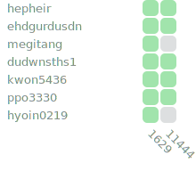

# Algorithm Study Season3

활동 시작일: 2024년 6월 27일 목요일



## 진행 방식

1. 스터디 시간마다, 문제를 1~2개 선정한다.
2. 스터디 시간 내에, 해당 문제 풀이에 필요한 알고리즘에 대하여 다함께 공부한다.
3. 다음 스터디까지 선정한 문제(들)을 각자 풀어온다.
4. 다음 스터디까지 새로 추천할 문제를 1개 이상 찾아온다.
    1. 문제 난이도는 최소 `S5` 이상을 기준으로 한다.

## 팀 내부 규정

### 벌금제도

<table>
    <thead>
        <tr>
            <th>항목</th>
            <th>지각 제출 시<br><small>(스터디 끝나기 전까지 제출 시 인정)</small></th>
            <th>미제출 시</th>
        </tr>
    </thead>
    <tbody>
        <tr>
            <td>해당 주차에 풀어온 문제가 push 되어있지 않을 시</td>
            <td align="center">1,000원</td>
            <td align="center">2,000원</td>
        </tr>
        <tr>
            <td>해당 주차에 README.md에 찾아온 문제가 없을 시</td>
            <td align="center" colspan="2">1,000원</td>
        </tr>
    </tbody>
</table>

-   지불한 벌금은 모두 모임통장에서 관리하며 해당 벌금은 팀 회식 때 사용됨

### 현재 벌칙 누적금

<table>
    <thead>
        <tr>
            <th>김동주</th>
            <th>서동혁</th>
            <th>정우현</th>
            <th>손영준</th>
            <th>총 합<small>(원)</small></th>
        </tr>
    </thead>
    <tbody>
        <tr>
            <td>0</td>
            <td>0</td>
            <td>0</td>
            <td>0</td>
            <td>0</td>
        </tr>
    </tbody>
</table>

## 활동 멤버

<table>
    <thead>
        <tr>
            <th>김동주</th>
            <th>서동혁</th>
        </tr>
    </thead>
    <tbody>
        <tr>
            <td>
                <a href="https://solved.ac/profile/hepheir">
                    
                </a>
            </td>
            <td>
                <a href="https://solved.ac/profile/ehdgurdusdn">
                    
                </a>
            </td>
        </tr>
    </tbody>
</table>

<table>
    <thead>
        <tr>
            <th>정우현</th>
            <th>손영준</th>
        </tr>
    </thead>
    <tbody>
        <tr>
            <td>
                <a href="https://solved.ac/profile/megitang">
                    
                </a>
            </td>
            <td>
                <a href="https://solved.ac/profile/dudwnsths1">
                    
                </a>
            </td>
        </tr>
    </tbody>
</table>

## 인턴

<table>
    <thead>
        <tr>
            <th>권동균</th>
            <th>박준석</th>
            <th>양효인</th>
        </tr>
    </thead>
    <tbody>
        <tr>
            <td>
                <a href="https://solved.ac/profile/kwon5436">
                    
                </a>
            </td>
            <td>
                <a href="https://solved.ac/profile/ppo3330">
                    
                </a>
            </td>
            <td>
                <a href="https://solved.ac/profile/hyoin0219">
                    
                </a>
            </td>
        </tr>
    </tbody>
</table>

---

## 과제 제출 방법

### 문제 풀이 코드 제출방법

매 주차 폴더가 생성되면, 각 주차 폴더 아래 자신의 이름으로 된 폴더를 하나 생성한다.
생성한 폴더에 자신이 풀이한 문제의 소스코드를 제출한다.

```text
.
├── 1주차 분할정복-거듭제곱
│   ├── 김동주              # 자신의 이름으로 폴더를 생성한다.
│   │   └── boj_1000.cpp    # 코드 파일 이름은 자유 (적당히 알잘딱깔센하게 지을 것)
│   ├── 정우현
│   │   ├── 1000_TLE.py     # TLE: (time limit exceeded, 시간 초과)
│   │   └── 1000.py
│   └── README.md           # 주차 별 README.md 파일
│
└── README.md               # 지금 보고있는 문서
```

### 추천 문제 제출 방법

각 주차 별 README.md 파일을 살펴보면 아래와 같이 "찾아온 문제들" 섹션이 존재한다.
자신의 이름을 찾아 아래와 같이 표를 채운다.

* 난이도는 두 글자로 표현한다. (예: 골드 4의 경우 `G4`로 적으면 된다.)
* 아래의 코드 스니펫에서 `-`로 시작하는 붉은 줄이 제거된 라인, `+`로 시작하는 초록색 줄이 추가된 라인이다.
* 표의 열은 `|`(파이프 기호)를 기준으로 구분된다. 이때, 열의 너비를 반드시 맞춰줘야 할 필요는 없다.

```diff
  ...

  ## 찾아온 문제들

  #### 김동주

  | 난이도 | 번호 | 제목 | 링크             |
  | ------ | ---- | ---- | ---------------- |
- | ![??]  | -    | -    | https://boj.kr/- |
+ | ![B5]  | 1000 | A+B  | https://boj.kr/1000 |

  #### 정우현

  | 난이도 | 번호 | 제목 | 링크             |
  | ------ | ---- | ---- | ---------------- |
  | ![??]  | -    | -    | https://boj.kr/- |

  ...
```

### GitHub에 Push 하기

**!! `main` 브랜치에서 작업하지 않는다 !!**

자신이 작업할 브랜치를 생성하고 각자 과제를 수행한 뒤 푸쉬한다.
푸시된 변경사항들은 스터디 시간 직전에 병합하는 것으로 한다.

* 브랜치명은 자신이 누구인지만 구분되게끔 알잘딱하게 지으면 된다.
* 실수로 `main` 브랜치를 수정하지 않도록 주의한다.

#### 브랜치 생성 방법

```shell
git checkout -b <branch_name>
```

#### 푸시 방법

```shell
git push origin <branch_name>
```

#### `main` 브랜치에 변경이 생겼다고 공지가 올라올 경우

아래의 명령어를 통해 `main` 브랜치의 변경사항을 자신의 브랜치에도 적용해주자.

```
# 내가 작업하는 브랜치에서 아래의 명령 실행

git rebase origin/main --committer-date-is-author-date
```

* 이 과정에서 [merge conflict](https://docs.github.com/ko/pull-requests/collaborating-with-pull-requests/addressing-merge-conflicts/about-merge-conflicts)가 발생할 수 있는데, 이 경우 함께 모여서 해결하도록 하자.

## 기타

* [여기 있는 누군가가 풀었는데 나는 못 푼 문제 모음](https://solved.ac/search?query=%28%40hepheir+%7C+%40ehdgurdusdn+%7C+%40megitang+%7C+%40dudwnsths1+%7C+%40kwon5436+%7C+%40ppo3330+%7C+%40hyoin0219%29+-+%40%24me)
